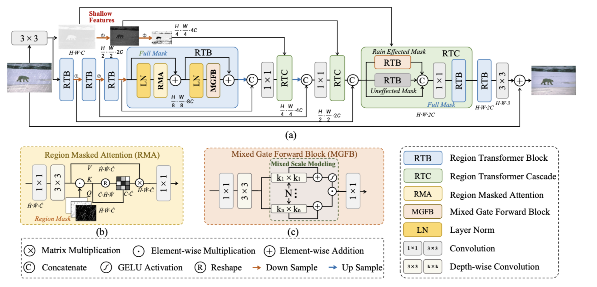
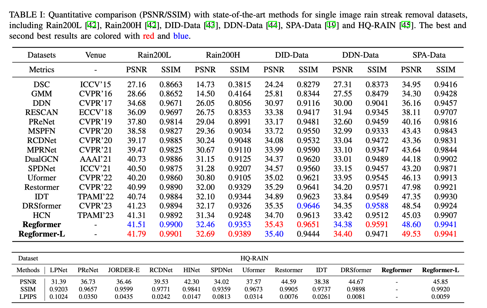
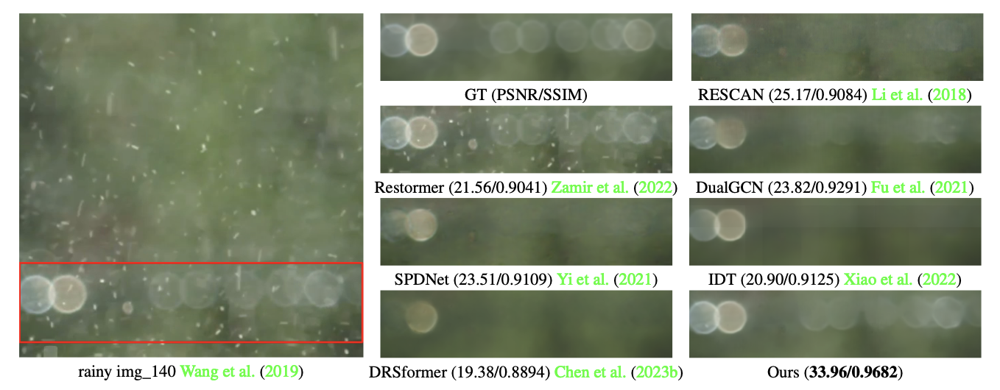
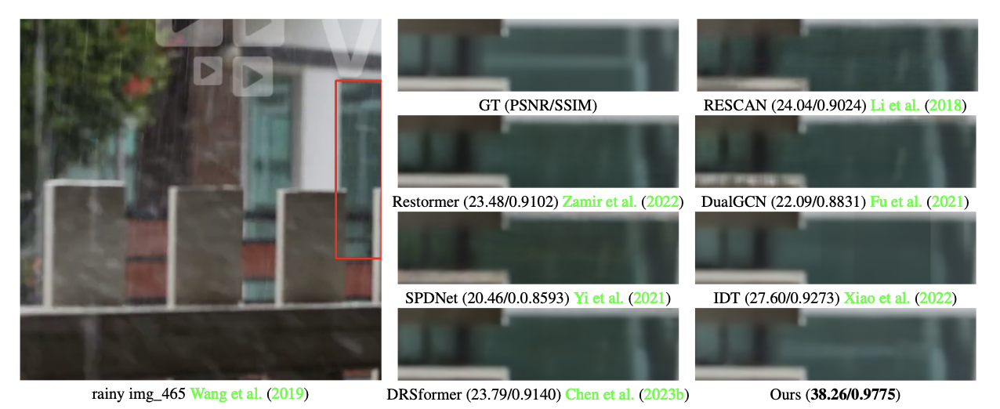

# Dive deep into regions: Exploiting regional information transformer for single image deraining

[Baiang Li](https://ztmotalee.github.io), [Zhao Zhang](https://sites.google.com/site/cszzhang), [Huan Zheng](), [Xiaogang Xu](https://xiaogang00.github.io), [Yanyan Wei](http://faculty.hfut.edu.cn/weiyanyan/en/index.htm), [Jingyi Zhang](), [Jicong Fan]() and [Meng Wang]()

[](https://arxiv.org/abs/2402.16033)
[]()
[]()

<hr />

> **Abstract:** *Transformer-based Single Image Deraining (SID) methods have achieved remarkable success, primarily attributed to their robust capability in capturing long-range interactions. However, we've noticed that current methods handle rain-affected and unaffected regions concurrently, overlooking the disparities between these areas, resulting in confusion between rain streaks and background parts, and inabilities to obtain effective interactions, ultimately resulting in suboptimal deraining outcomes. To address the above issue, we introduce the Region Transformer (Regformer), a novel SID method that underlines the importance of independently processing rain-affected and unaffected regions while considering their combined impact for high-quality image reconstruction. The crux of our method is the innovative Region Transformer Block (RTB), which integrates a Region Masked Attention (RMA) mechanism and a Mixed Gate Forward Block (MGFB). Our RTB is used for attention selection of rain-affected and unaffected regions and local modeling of mixed scales. The RMA generates attention maps tailored to these two regions and their interactions, enabling our model to capture comprehensive features essential for rain removal. To better recover high-frequency textures and capture more local details, we develop the MGFB as a compensation module to complete local mixed scale modeling. Extensive experiments demonstrate that our model reaches state-of-the-art performance, significantly improving the image deraining quality.*
<hr />

## Network Architecture



## Datasets
<table>
<thead>
  <tr>
    <th>version</th>
    <th>Rain200L</th>
    <th>Rain200H</th>
    <th>DID-Data</th>
    <th>DDN-Data</th>
    <th>SPA-Data</th>
  </tr>
</thead>
<tbody>
  <tr>
    <td>Baidu Cloud</td>
    <td> Regformer</a> </td>
    <td> <a href="">Download</a> </td>
    <td> <a href="">Download</a> </td>
    <td> <a href="">Download</a> </td>
    <td> <a href="">Download</a> </td>
    <td> <a href="">Download</a> </td>
    </tr>
<tr>
    <td> Regformer-L</a> </td>
    <td> <a href="">Download</a> </td>
    <td> <a href="">Download</a> </td>
    <td> <a href="">Download</a> </td>
    <td> <a href="">Download</a> </td>
    <td> <a href="">Download</a> </td>
  </tr>
</tbody>
</table>
## Training
```
cd Regformer
bash train.sh
```
Run the script then you can find the generated experimental logs in the folder `experiments`.

## Training
```
python basicsr/train.py -opt Options/Deraining.yml
```
Change the yaml file to Deraining-L.yml if you use Regformer-L.

## Testing
```
python test.py --task Deraining --input_dir './test/input/' --result_dir './test/output/'
```

## Pre-trained Models
<table>
<thead>
  <tr>
    <th>Dataset</th>
    <th>Rain200L</th>
    <th>Rain200H</th>
    <th>DID-Data</th>
    <th>DDN-Data</th>
    <th>SPA-Data</th>
  </tr>
</thead>
<tbody>
  <tr>
    <td>Baidu Cloud</td>
    <td> <a href="">Download</a> </td>
    <td> <a href="">Download</a> </td>
    <td> <a href="">Download</a> </td>
    <td> <a href="">Download</a> </td>
    <td> <a href="">Download</a> </td>
  </tr>
</tbody>
<tbody>
  <tr>
    <td>Google Drive</td>
    <td> <a href="">Download</a> </td>
    <td> <a href="">Download</a> </td>
    <td> <a href="">Download</a> </td>
    <td> <a href="">Download</a> </td>
    <td> <a href="">Download</a> </td>
  </tr>
</tbody>
</table>

## Performance Evaluation


## Visual Deraining Results




## Citation
If you are interested in this work, please consider citing:
```
@misc{li2024diving,
      title={Diving Deep into Regions: Exploiting Regional Information Transformer for Single Image Deraining}, 
      author={Baiang Li and Zhao Zhang and Huan Zheng and Xiaogang Xu and Yanyan Wei and Jingyi Zhang and Jicong Fan and Meng Wang},
      year={2024},
      eprint={2402.16033},
      archivePrefix={arXiv},
      primaryClass={cs.CV}
}
```
## Acknowledgment
This code is based on the [Restormer](https://github.com/swz30/Restormer). Thanks for their awesome work. Additionally, this github page is based on [DRSformer](https://github.com/cschenxiang/DRSformer).

## Contact
Should you have any question or suggestion, please contact ztmotalee@gmail.com.
